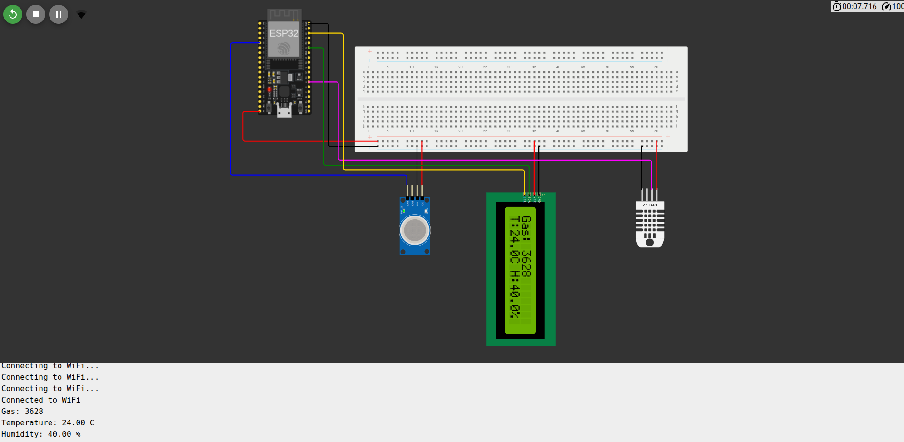

# Project Deliverable 3

### Group 2 Members (Arduino) 
150460	Makau Nathan Maganga

145768	Ogato Deborah Kerubo 

166326	Muriithi Alvin

169648	Kamau Joseph Manene

162437	Ngigi Alex

150320	Timothy Muigai

150767	Leon Bundi

## Simulation

[Open the Wokwi Simulation](https://wokwi.com/projects/434113115355726849)

## Physical prototype

### Challenges

As illustrated in the screenshot, the MQ-5 gas sensor worked as expected and the results can be seen in the serial monitor. However, we could not get readings of humidity and temperature from the DHT-22 and the LCD was powering on but not displaying results.

### Possible Solutions

We faced a similar problem (failing to read from DHT-22) in question b and discovered that adding a resistor when connecting the DHT-22 to the esp32 board solved the problem. Due to time we did not implement this in question a. However, we did in question b and were successful.

For the LCD powering on but not displaying results, we tried exchanging with other LCDs but we were unable to resolve the issue. Perhaps adding a resistor too would solve the problem

# Question b

## Simulation

### Board 1:
[Question B Board 1 Simulation with MQ-5](https://wokwi.com/projects/468368958463897601](https://wokwi.com/projects/434113115355726849)

### Board 2:
[Question B Board 2 Simulation with DHT-22](https://wokwi.com/projects/468369775687442433)

## Physical prototype

### Demonstration Video
[▶️ Watch the demonstration video](WhatsApp%20Video%202026-07-02%20at%205.57.35%20PM.mp4)

### Explanation
As illustrated in the demo video above which can be downloaded, the board with the MQ-5 sends its gas results to the board with DHT-22. Both the results of DHT-22 and MQ-5 are printed in the serial monitor.
# Question c

## Simulation

### Board 1:
[Question C Board 1 Simulation](https://wokwi.com/projects/468249352594753537)

### Board 2:
[Question C Board 2 Simulation](https://wokwi.com/projects/468252073689667585)

### Explanation
ESP32 Node 2 continuously monitors gas concentration levels using the MQ-5 sensor. The gas readings are published to an MQTT topic hosted on a public broker.
ESP32 Node 1 subscribes to the same MQTT topic and receives gas concentration data in real time. Upon receiving the data, the node analyses the gas level and activates the relay whenever the gas concentration exceeds a predefined threshold.
Additionally, ESP32 Node 1 measures temperature and humidity using the DHT22 sensor and publishes the readings to separate MQTT topics.

# Group Photo

