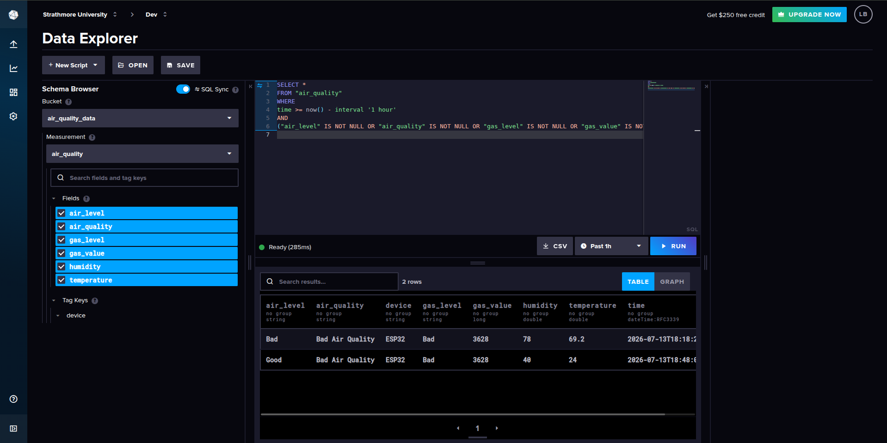
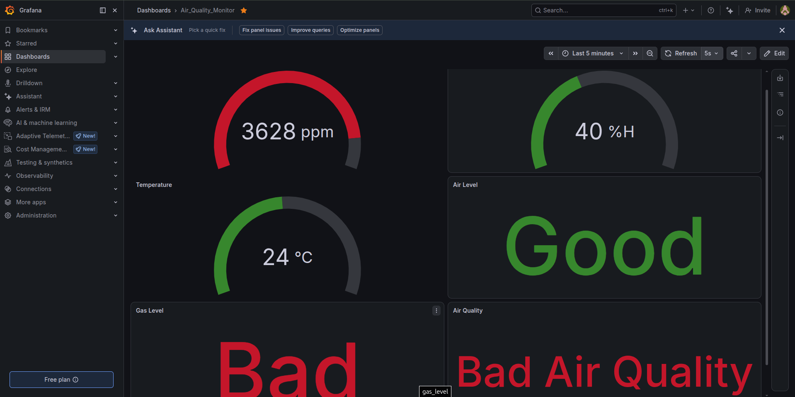

# Project Deliverable 3

### Group 2 Members (Arduino) 
150460	Makau Nathan Maganga

145768	Ogato Deborah Kerubo 

166326	Muriithi Alvin

169648	Kamau Joseph Manene

162437	Ngigi Alex

150320	Timothy Muigai

150767	Leon Bundi

## Wokwi Simulation

[Open the Wokwi Simulation](https://wokwi.com/projects/434113115355726849)


## System Logic

The ESP32 acts as the central controller of the system. It continuously collects environmental data, analyzes it, displays the results locally, and uploads it to the cloud for monitoring and visualization.

### Overall Workflow

```text
MQ-2 Gas Sensor ──┐
                  │
DHT22 Sensor ─────┼──► ESP32
                  │
                  ├──► LCD Display
                  │
                  ├──► Wi-Fi
                  │
                  ├──► InfluxDB (Cloud Storage)
                  │
                  └──► Grafana Dashboard (Visualization)
```

---

## Step 1: Initialize the System

When the ESP32 starts, it performs the following tasks:

- Initializes the DHT22 temperature and humidity sensor.
- Initializes the MQ-2 gas sensor.
- Initializes the 16×2 I2C LCD display.
- Connects to the Wi-Fi network.
- Establishes a connection to the InfluxDB cloud database.

Once all components are initialized successfully, the system begins monitoring the environment.

---

## Step 2: Collect Sensor Data

The ESP32 continuously reads data from two sensors:

- **MQ-2 Gas Sensor** – Measures the concentration of gases in the surrounding environment.
- **DHT22 Sensor** – Measures temperature and humidity.

These readings represent the current environmental conditions.

---

## Step 3: Evaluate Environmental Conditions

The sensor readings are compared against predefined thresholds.

### Air Level (Temperature & Humidity)

| Air Level | Temperature | Humidity |
|-----------|------------:|---------:|
| Good | 22–30°C | 30–60% |
| Normal | 30–40°C | 60–70% |
| Bad | Outside these ranges | Outside these ranges |

### Gas Level

| Gas Sensor Reading | Gas Level |
|-------------------:|-----------|
| 0–1364 | Good |
| 1365–2730 | Normal |
| Above 2730 | Bad |

---

## Step 4: Determine Overall Air Quality

The ESP32 combines both evaluations to determine the overall air quality.

- If both the **Air Level** and **Gas Level** are **Good** or **Normal**, the environment is classified as **Good Air Quality**.
- If either the **Air Level** or **Gas Level** is **Bad**, the environment is classified as **Bad Air Quality**.

This provides users with a simple overall assessment instead of requiring them to interpret multiple sensor readings.

---

## Step 5: Display Results on the LCD

The LCD cycles through the following information every few seconds:

1. Gas sensor reading
2. Temperature and humidity
3. Air Level
4. Gas Level
5. Overall Air Quality

This allows users to monitor the environment directly from the device without accessing the dashboard.

---

## Step 6: Store Data in InfluxDB

After processing the sensor readings, the ESP32 sends the data to **InfluxDB**, where each measurement is stored with a timestamp.

The following information is recorded:

- Gas sensor value
- Temperature
- Humidity
- Gas Level
- Air Level
- Overall Air Quality

This creates a historical database that can be queried at any time.



---

## Step 7: Visualize Data in Grafana

Grafana connects directly to InfluxDB and retrieves the stored sensor data.

The dashboard displays:

- Temperature trends over time
- Humidity trends
- Gas sensor readings
- Current air quality status
- Historical environmental data

This enables users to monitor both real-time conditions and long-term environmental changes through interactive charts and graphs.


---

## Complete System Flow

```text
1. ESP32 starts
        │
        ▼
2. Connect to Wi-Fi
        │
        ▼
3. Read MQ-2 and DHT22 sensors
        │
        ▼
4. Classify:
      • Air Level
      • Gas Level
      • Overall Air Quality
        │
        ▼
5. Display results on LCD
        │
        ▼
6. Upload data to InfluxDB
        │
        ▼
7. Grafana retrieves data from InfluxDB
        │
        ▼
8. Dashboard displays real-time and historical environmental data
```

---

## Why InfluxDB and Grafana?

### InfluxDB

InfluxDB is used as the cloud database for storing sensor readings. Every measurement is automatically timestamped, allowing environmental data to be stored and analyzed over time instead of being lost after each reading.

### Grafana

Grafana connects to InfluxDB to visualize the stored data through interactive dashboards. Users can view live sensor values, monitor historical trends, and quickly identify changes in environmental conditions.

Together, they provide a complete IoT monitoring pipeline:

```text
ESP32 + Sensors
        │
        ▼
Wi-Fi
        │
        ▼
InfluxDB (Data Storage)
        │
        ▼
Grafana (Visualization Dashboard)
```
## Group Meeting photo
